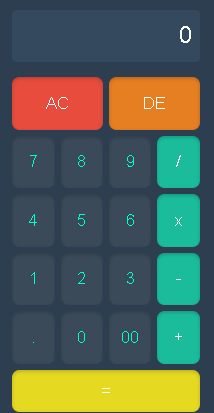

# Calculator

A simple, responsive calculator web application inspired by the iPhone calculator design. This project demonstrates basic HTML, CSS, and JavaScript skills.

## Features

- **Dark Theme**: A visually appealing dark theme with rounded buttons.
- **Responsive Design**: The layout adjusts to fit different screen sizes.
- **Basic Operations**: Supports addition, subtraction, multiplication, and division.
- **Clear and Delete**: Includes "AC" (All Clear) and "DE" (Delete) buttons for input management.

## Technologies Used

- **HTML**: For the structure of the calculator.
- **CSS**: For styling the calculator, including grid layout and button design.
- **JavaScript**: For implementing the calculator's functionality.

## How to Use

1. Clone the repository:
   ```bash
   git clone <repository-url>
   ```
2. Open the `index.html` file in your browser.
3. Use the calculator for basic arithmetic operations.

## Screenshots



## License

This project is licensed under the MIT License. Feel free to use and modify it as you like.

## Contributing

Contributions are welcome! If you have suggestions or improvements, feel free to open an issue or submit a pull request.
